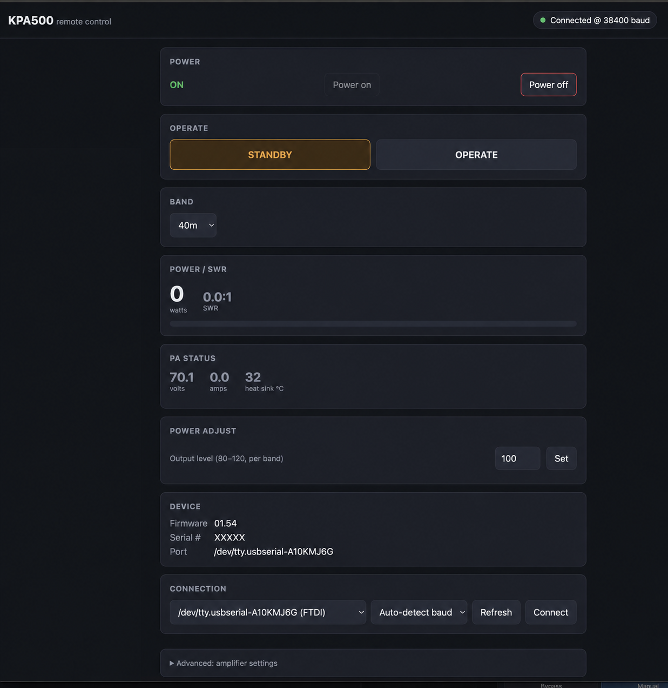

# KPA-500 Web App Remote

A browser-based remote control panel for the [Elecraft KPA500](https://elecraft.com/products/kpa500-compact-160-6-m-solid-state-amplifier) 500W linear amplifier — operate it from any browser tab (Chrome, Safari, mobile) instead of Elecraft's desktop-only utility.

Created by **K2COP**.



## Why this exists

The KPA500 is serial-only, reachable over its rear-panel "PC" RS-232 port. Elecraft's own `KPA500 Utility` covers that, but it's Windows/Mac desktop software tied to whatever machine it's installed on.

This is a companion project to the [KAT500 web remote](https://github.com/K2COP/kat-500-web-app-remote) — same bridge-server pattern, same look and feel, so operating the tuner and the amp side by side feels like one app. A small Node.js server holds a USB-serial connection to the amplifier and exposes a live control panel over HTTP/WebSocket, so you can operate it (standby/operate, band, power level, fault handling) from a browser anywhere on your network — or remotely, tunneled alongside your station's other remote-operating tools.

It talks to the KPA500 using the ASCII command set documented in Elecraft's own [KPA500 Programmer's Reference](https://ftp.elecraft.com/KPA/Manuals%20Downloads/KPA500%20Programmers%20Ref.pdf) (a copy is included in `docs/reference/`).

## Features

- **Power** — soft power on/off. Off puts the amp in its bootloader, listening for the remote "power on" command (no trip to the rear panel needed); on sends that command.
- **Operate / Standby** — the main TX-enable toggle, with live status
- **Band select** — same 00–10 band table as the KAT500
- **Power Adjust** — per-band output level (80–120)
- **Live telemetry** — output watts + SWR while transmitting, PA volts/current, heat-sink temperature
- **Fault display** — with one-click clear
- **Device info** — firmware revision, serial number, connected port
- **Advanced settings** — ALC threshold, fan minimum speed, TR delay, attenuator fault release time, stay-in-standby-on-band-change, INHIBIT# input enable, fault speaker, demo mode, radio interface type
- **Baud auto-detection** — probes 38400 / 19200 / 9600 / 4800, same as the KAT500 app
- **Auto-reconnect** — remembers the last working serial port and baud rate, and reconnects automatically after a server restart or a dropped connection
- **Advanced raw command console** — every command in Elecraft's reference works here (`^RVM`, `^BN05`, etc.), for anything outside the main panel

## How it works

```
Browser (Chrome/Safari/mobile) <--HTTP/WebSocket--> Node.js server <--RS-232 (USB-serial)--> KPA500
```

The server owns a single serial connection to the amp and enforces the flow-controlled request/response pacing it expects (each SET is followed by a null `;` sync command, since SETs themselves produce no response), so multiple browser tabs can safely share one connection. It polls live values (power/SWR, fault, PA volts/current/temp) on an interval and pushes updates to every connected browser over a WebSocket.

## Requirements

- An Elecraft KPA500, connected to your computer via its "PC" serial port (USB-to-serial adapter or native serial port)
- [Node.js](https://nodejs.org/) (LTS)

## Setup

This app runs on whatever computer the KPA500's USB/serial cable is plugged into — that machine acts as the server, and any browser (on that machine or elsewhere on your network) connects to it. You don't need any programming experience to set it up, just the steps below.

### 1. Install Node.js

This is the program the server runs on top of.

1. Go to **https://nodejs.org** and download the version marked **LTS** (not "Current")
2. Run the installer with the default options

**Check it worked** — open a terminal (see below) and run:
```
node --version
```
You should see something like `v20.x.x`.

- **Windows:** open the Start Menu, type `cmd`, press Enter
- **macOS:** press `Cmd+Space`, type `Terminal`, press Enter

### 2. Get the code onto your computer

On this GitHub page, click the green **`<> Code`** button → **Download ZIP**, then extract it:
- **Windows:** right-click the downloaded ZIP → **Extract All**
- **macOS:** double-click the downloaded ZIP in Finder — it extracts automatically. Note the extracted folder will be named `kpa500-web-app-remote-main`.

*(If you're comfortable with git, `git clone https://github.com/K2COP/kpa500-web-app-remote.git` works too.)*

### 3. Open a terminal in that folder

- **Windows:** open the extracted folder in File Explorer, click in the address bar at the top, type `cmd`, press Enter — a command prompt opens already pointed at that folder.
- **macOS:** right-click the extracted folder in Finder → **New Terminal at Folder**. (If that option isn't there, open Terminal and type `cd ` followed by dragging the folder into the window, then press Enter.)

### 4. Install and start the app

In that terminal, run:
```
npm install
```
Wait for it to finish (downloads some files, ~30 seconds), then:
```
npm start
```
You should see `KPA500 web control listening on http://localhost:8600`. **Leave this window open** — closing it stops the app.

### 5. Plug in the KPA500 and connect

1. Connect the KPA500 to this computer via USB and power it on (rear panel switch).
2. If you normally run Elecraft's own `KPA500 Utility`, close it first — only one program can hold the serial port at a time.
3. Open Chrome or Safari and go to **http://localhost:8600**
4. In the **Connection** panel, pick your device from the port dropdown, leave baud on **Auto-detect**, and click **Connect**.

If the port doesn't show up, the USB-to-serial adapter's driver probably isn't installed — check [Silicon Labs](https://www.silabs.com/developers/usb-to-uart-bridge-vcp-drivers) or [FTDI](https://ftdichip.com/drivers/vcp-drivers/) depending on your adapter's chip.

### Next time

Just repeat steps 3–4 (`npm start`), then open the browser page again. The server remembers your serial port and baud rate and reconnects automatically.

Running this alongside the [KAT500 web remote](https://github.com/K2COP/kat-500-web-app-remote)? They use different ports by default (KAT500 on 8500, KPA500 on 8600) so both can run at once, each in its own terminal — closing/Ctrl-C'ing one won't affect the other. Change `httpPort` in `config.json` if either conflicts with something else on your machine.

**Heads up:** run with `npm start` this way, the app only stays up as long as its terminal window/tab stays open. If you want it to survive closing that terminal, see below.

### Keep it running automatically (macOS, recommended)

Instead of leaving a terminal window open, you can have macOS run the server in the background as a `launchd` agent — it starts automatically at login and restarts itself if it ever crashes, independent of any terminal.

1. Find your Node.js path: `which node` (copy the output).
2. Create `~/Library/LaunchAgents/com.k2cop.kpa500-web-remote.plist`:
   ```xml
   <?xml version="1.0" encoding="UTF-8"?>
   <!DOCTYPE plist PUBLIC "-//Apple//DTD PLIST 1.0//EN" "http://www.apple.com/DTDs/PropertyList-1.0.dtd">
   <plist version="1.0">
   <dict>
       <key>Label</key>
       <string>com.k2cop.kpa500-web-remote</string>
       <key>ProgramArguments</key>
       <array>
           <string><!-- paste `which node` output here --></string>
           <string><!-- absolute path to this project's server/index.js --></string>
       </array>
       <key>WorkingDirectory</key>
       <string><!-- absolute path to this project folder --></string>
       <key>RunAtLoad</key>
       <true/>
       <key>KeepAlive</key>
       <true/>
       <key>StandardOutPath</key>
       <string>~/Library/Logs/kpa500-web-remote.log</string>
       <key>StandardErrorPath</key>
       <string>~/Library/Logs/kpa500-web-remote.err.log</string>
   </dict>
   </plist>
   ```
3. Load it: `launchctl bootstrap gui/$(id -u) ~/Library/LaunchAgents/com.k2cop.kpa500-web-remote.plist`

Useful commands afterward:
```
launchctl list | grep k2cop                                           # check it's running (shows a PID)
launchctl kickstart -k gui/$(id -u)/com.k2cop.kpa500-web-remote       # restart it
launchctl bootout gui/$(id -u)/com.k2cop.kpa500-web-remote            # stop it (until next login)
tail -f ~/Library/Logs/kpa500-web-remote.log                          # watch its output
```
To stop it permanently, `bootout` it (above) and delete the `.plist` file.

### Keep it running automatically (Windows, recommended)

Windows doesn't have `launchd`, but Task Scheduler does the same job — runs the server in the background at login and restarts it if it crashes, without a terminal window open.

1. Find your Node.js path: open a command prompt and run `where node` (copy the first line it prints).
2. Open **Task Scheduler** (Start Menu → type "Task Scheduler").
3. In the right-hand panel, click **Create Task…** (not "Create Basic Task" — this one has the extra options we need).
4. **General** tab: name it `KPA500 Web Remote`. Leave the rest default.
5. **Triggers** tab → **New…** → Begin the task: **At log on** → OK.
6. **Actions** tab → **New…**:
   - Program/script: the path from step 1 (e.g. `C:\Program Files\nodejs\node.exe`)
   - Add arguments: `server\index.js`
   - Start in: the full path to this project folder (e.g. `C:\Users\YourName\kpa500-web-app-remote`)
   - OK
7. **Conditions** tab: uncheck "Start the task only if the computer is on AC power" if this is a laptop.
8. **Settings** tab: check **If the task fails, restart every:** and set it to `1 minute`, with a generous restart count (e.g. `999`).
9. Click **OK** to save (enter your Windows password if prompted).

The task also runs immediately the next time you log in. To test it now without logging out, find it in the Task Scheduler Library list, right-click → **Run**, then check **http://localhost:8600**.

To stop it permanently, right-click the task → **Disable** (or **Delete**).

## Remote operation

Same as the KAT500 app: if you're running [TCI Remote Compactor](https://pure-editions.com/on7off/TCI-Remote-Compactor/) or another tunnel (Tailscale, WireGuard, SSH port-forward) for your station, point it at `http://localhost:8600` alongside the KAT500's `:8500`.

## Notes on the command set

A few things worth knowing if you dig into `server/kpa500.js` or the raw console:

- The Programmer's Reference documents `^FC` (fan minimum) as a single-digit SET with a single-digit response, but the actual firmware (tested against v01.54) responds zero-padded (`^FC00`) while still expecting a single, unpadded digit on SET. The driver accounts for this.
- `^FL` fault codes aren't enumerated with text in the Programmer's Reference (only that `00` = no fault); the panel shows the numeric code.
- `^BRP`/`^BRX` (serial port baud rate) are reachable via the raw console but have no dedicated button — changing the PC port's rate will immediately drop this app's connection until you reconnect at the new rate.
- Powering the amp off (`^ON0`) leaves it listening in its bootloader for a bare `P` command to bring it back — that's what the "Power on" button sends. This does not replace the rear-panel switch.

## Scope

This covers the "operate" surface. It intentionally does not cover firmware updates (the bootloader `D` command is Elecraft-internal and destructive if misused, so it's deliberately not exposed).

## Related

Companion project: [KAT500 web remote](https://github.com/K2COP/kat-500-web-app-remote), for the Elecraft KAT500 automatic antenna tuner.

## Disclaimer

This is an independent, community project and is not affiliated with, endorsed by, or supported by Elecraft, Inc. "Elecraft" and "KPA500" are trademarks of Elecraft, Inc. Use at your own risk — this software controls a live RF power amplifier.

## License

[GPL-3.0](LICENSE) © K2COP
